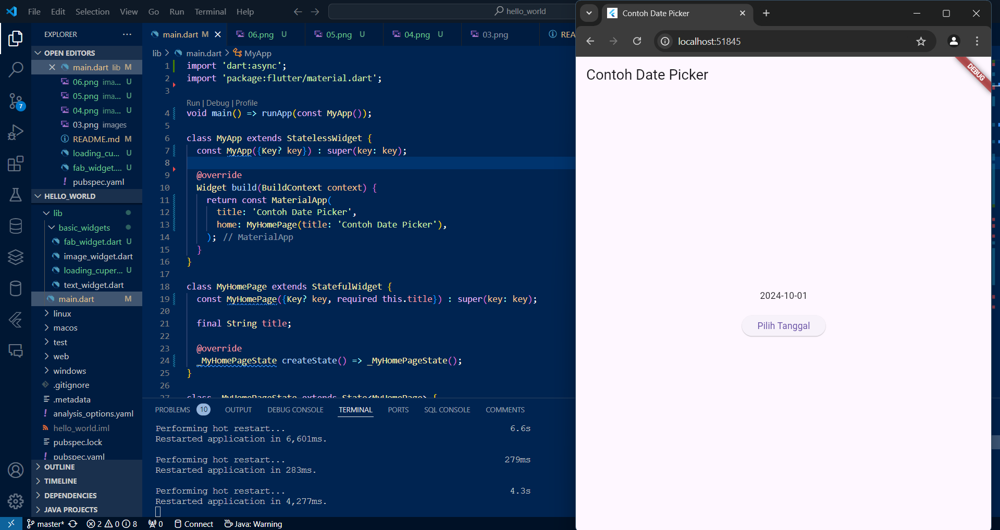
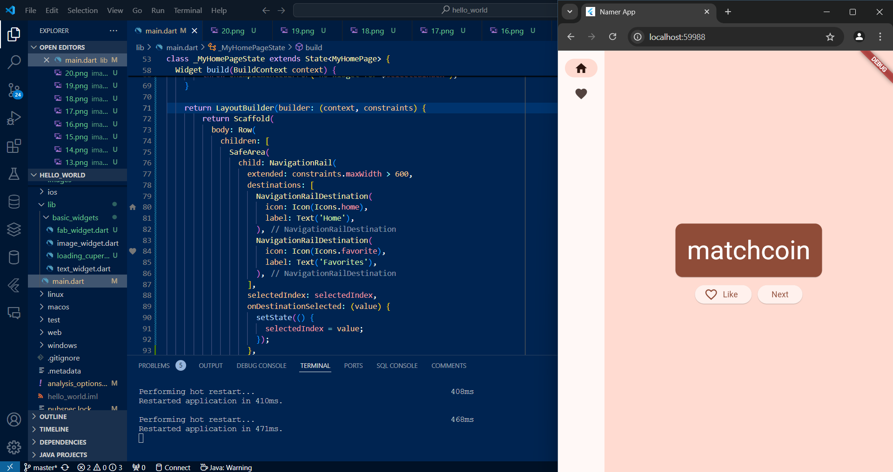

# hello_world

# A new Flutter project.

### Membuat project flutter baru

### Merubah teks yang berada pada aplikasi

### Mengganti teks dengan gambar

### Menambahkan scaffold untuk mengatur layout halaman

### Menambahkan widget dialog ketika tombol ditekan

### Menambahkan form input teks

### Menambahkan form input tanggal

# Codelab google

## Adding the first button

Menambahkan tombol next
## First Behaviour

Before

After

Menambahkan fungsi kepada tombol next sehingga ketika ditekan, kata akan berubah
## Make The App Prettier

### Add card

Menambahkan card pada kata sehingga halaman terlihat menarik
### Change theme and style

Mengganti warna teks dan warna card
### Improve accessibility

menyediakan label semantik untuk aksesibilitas dimana teks dapat dibaca dengan screen reader

Center the UI

mengganti posisi elemen ke tengah halaman dan menghilangkan teks "A random AWESOME idea"

## Add Functionality

Menambahkan tombol like

## Add Navigation Rail

### menambahkan nav bar

### Stateless vs stateful widgets and setState

dengan tambahan setState, UI tombol favorite akan berubah ketika ditekan

### Use Selected Index

penambahan halaman placeholder untuk tombol favorites

### Responsiveness

before

after

menambahkan responsifitas nav bar, ketika ada ruang yang cukup untuk menampilkan label maka label akan terlihat.

## Add a new page

Menambahkan halaman baru dan penghitung like, halaman baru berisi kata yang diberi like